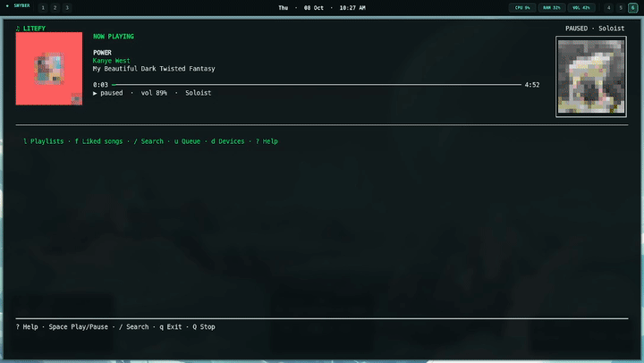

# Litefy

A terminal Spotify music browser and player. Litefy controls the local `spotifyd` receiver for playback; it does not route playback to the Spotify desktop app, phone, or another Connect device.

## Screenshots



## Install

Requirements: Linux, Python 3.10 or newer with `venv`/`pip` support, `curl`, `tar`, `sha512sum`, and a Spotify Premium account. On PipeWire desktops, the PulseAudio compatibility service (`pipewire-pulse`) is recommended.

1. Download or clone this project and open a terminal in its folder.
2. Run:

   ```sh
   ./install.sh
   ```

   The installer creates a Python environment, installs Litefy's dependencies, downloads and checksum-verifies an official Spotifyd desktop binary if one is not installed, creates a local Spotifyd config if needed, and starts Spotifyd's one-time browser sign-in when no Spotifyd credentials are saved. It also installs a `litefy` launcher in `~/.local/bin`.

3. Create a Spotify app in the [Spotify Developer Dashboard](https://developer.spotify.com/dashboard). In the app settings, add this exact Redirect URI:

   ```text
   http://127.0.0.1:8888/callback
   ```

   It must match Litefy's `.env` value exactly. Use the loopback IP `127.0.0.1`, not `localhost`.

4. Copy the Spotify app's Client ID and Client Secret into `.env`:

   ```dotenv
   SPOTIPY_CLIENT_ID=your_client_id
   SPOTIPY_CLIENT_SECRET=your_client_secret
   SPOTIPY_REDIRECT_URI=http://127.0.0.1:8888/callback
   ```

   Keep `.env` private; it is ignored by Git. These Web API credentials are separate from the browser sign-in performed by Spotifyd. Use the same Spotify account for both sign-ins.

5. Start Litefy:

   ```sh
   litefy
   ```

   If your shell reports `litefy: command not found`, run `~/.local/bin/litefy` or add `~/.local/bin` to your `PATH`. You can also run `./litefy` from the project folder. If you move the project, rerun `./install.sh` to update the launcher.

   On first launch, Litefy opens Spotify authorization in your browser. Approve access with the account you want to use. Litefy starts the local Spotifyd Connect receiver and targets only that device for playback.

## Spotifyd setup

`install.sh` runs `setup_spotifyd.sh` automatically. To repeat or repair the Spotifyd setup later, run:

```sh
./setup_spotifyd.sh
```

The helper installs the official `full` Linux release to `~/.local/bin/spotifyd` when needed, verifies its published SHA-512 checksum, writes a default config to `~/.config/spotifyd/spotifyd.conf` without replacing an existing config, and guides you through Spotifyd OAuth sign-in. The default device name is **Litefy**; an existing configured `device_name` is preserved and used by Litefy.

If Spotifyd cannot open audio, check that PulseAudio or PipeWire's PulseAudio compatibility layer is running. To choose a different Spotifyd backend, edit `backend` in `~/.config/spotifyd/spotifyd.conf` and consult the [Spotifyd configuration guide](https://docs.spotifyd.rs/configuration/).

## Keys

- `/` search songs and artists; use **←/→** to switch search tabs.
- **↑/↓** select a result; **Enter** opens an artist or album, or plays a song.
- **o** opens the primary artist profile for the current track.
- **?** opens the named shortcut guide; use **Tab** or **←/→** to switch pages, and **Esc** to close it.
- **q** quits Litefy and leaves Spotifyd playback running; **Q** pauses playback, stops Spotifyd if Litefy started it, and quits.
- **Space** toggles playback; **n/p** skips tracks.
- The footer shows the other available controls.

## Troubleshooting

- **Missing Litefy credentials:** fill all three `SPOTIPY_*` entries in `.env`.
- **Redirect URI mismatch:** confirm the Spotify Developer Dashboard and `.env` both use `http://127.0.0.1:8888/callback` exactly.
- **No Spotifyd device:** run `./setup_spotifyd.sh`, then check `~/.config/spotifyd/spotifyd.conf` and the Spotifyd sign-in.
- **No audio:** check the configured Spotifyd backend and the local PulseAudio/PipeWire output.
- **Small terminal:** use a terminal at least 60 columns wide and 18 rows tall.

## License

Litefy is licensed under the MIT License. See [LICENSE](LICENSE).
